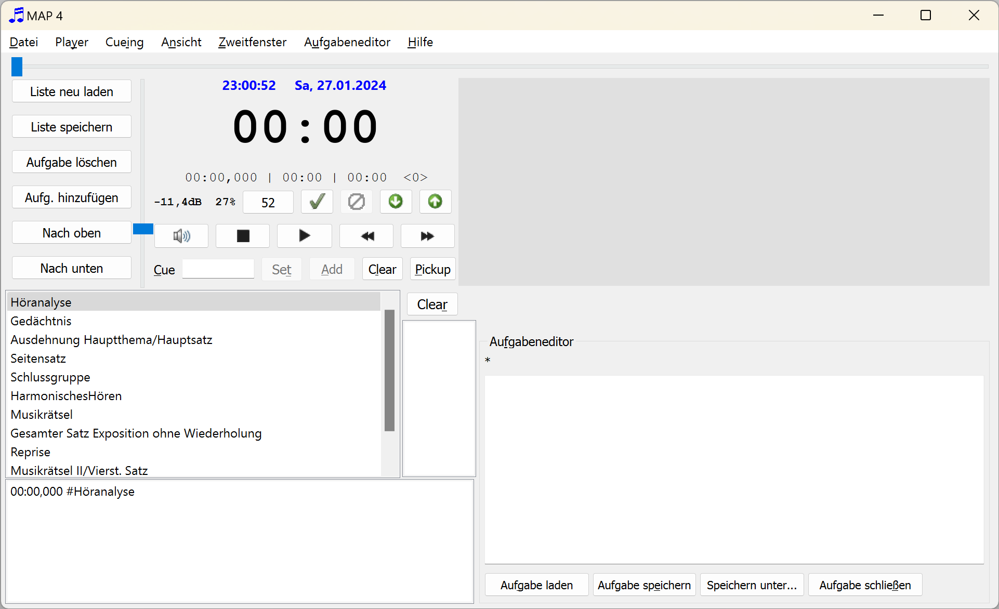
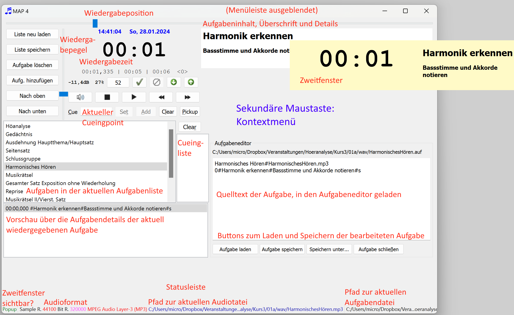

# MAP

MAP ist ein Programm zum Abspielen von wav- und mp3-Dateien, gekoppelt mit Kommentaren, Hinweistexten oder Höraufgaben, die nach einer bestimmten Zeitvorgabe gestartet werden. Die Hinweistexte können zusammen mit einer Uhr in einem zweiten Programmfenster dargestellt werden, das bei Bedarf auf einen zweiten Bildschirm geschoben werden kann und dort als "always on top" - Fenster über weiteren Inhalten (z. B. einer Präsentation) dargestellt werden kann.

MAP für den Einsatz in Lehrveranstaltungen zur Höranalyse und zur Präsentation von Musikbeispielen in Vorlesungen und dergleichen entwickelt.

Die Benutzung von MAP geschieht auf eigene Gefahr. © 2016 by Manfred Dings. [Lizenz](#Lizenz).

### Inhaltsübersicht

[Programmkonzept und erste Schritte](#Programmkonzept)

[Menübefehle](#Menubefehle)

[Die Programmoberfläche](#Programmoberflache)

[Anhang](#Anhang)

<a name="Programmkonzept"></a>

# Programmkonzept und erste Schritte

Programmkonzept und erste Schritte
MAP spielt wie ein üblicher MP3-Player wav- und mp3-Dateien ab ([Hinweise zum mp3-Dateiformat](#FormatSounddateien) beachten). Bei der Wiedergabe läuft eine Uhr mit, zusätzlich lassen sich Hinweise zu exakt definierbaren Zeitpunkten einblenden. Dazu sind benötigt das Programm ein abgestuftes System von Dateien: sog. [Aufgabenlisten](#Aufgabenlisten) und [Aufgabendateien](#Aufgabendateien), beides einfache Textdateien, die sich in jedem Editor bearbeiten lassen, bei Bedarf auch [im Programm selber](#BefehleImMenuAufgabeneditor). [Aufgabenlisten](#Aufgabenlisten) (*.`afl`) bilden dabei so etwas wie Playlisten. Sie enthalten die Dateinamen von Aufgabendateien (`*.auf`), die sich im selben Verzeichnis wie die Aufgabenliste selbst befinden müssen. Hier ein Beispiel für den Inhalt einer Aufgabendatei:

```
Aufgabe01.auf
Aufgabe02.auf
Aufgabe03.auf
Aufgabe04.auf
Aufgabe04a.auf
```
Mit dem Menübefehl [Aufgabenliste Laden (F2)](#AufgabenlisteLaden) wird eine solche Aufgabenliste eingelesen. Im Listenfeld links im Programmfenster werden die Beschreibungen der Aufgabendateien sichtbar und können dort per Menübefehl oder durch Mausklick ausgewählt werden.



Die Aufgabendateien wiederum enthalten einen Aufgabentitel, den relativen Pfad zu einer wav- oder mp3-Datei sowie optional Zeitmarken, zu denen Hinweistexte im Programmfenster bzw. im Zweitfenster dargestellt werden können. Ein Beispiel für eine Aufgabendatei:

```
Klangbeispiel 1.1: Mozart, Quartett A-dur KV 464 I Exposition#\wav\MozartQuartettAKV464IExposition.mp3
0#<h1>Themen/Themenfreie Abschnitte</h1><p>Fest und locker gefügt?<p><ul><li>Motive?</li></ul>
```

Der erste Eintrag in der ersten Zeile bildet die Beschreibung der Aufgabe, die im Programm in der Liste dargestellt wird. Nach dem Trennzeichen # steht der relative Pfad zur Mediendatei. Sie kann im selben Verzeichnis wie die Aufgabenliste liegen oder - wie im Beispiel - in einem Unterverzeichnis.
Alle weiteren Zeilen blenden zu einem gegeben Zeitpunkt (im Beispiel 0 Sekunden) den nachfolgend gegebenen Text ein. Dieser Text ist vorzugsweise in HTML formuliert (hier also mit einer Überschrift, einem Absatz und einer Aufzählungliste mit einem Aufzählungspunkt).
Alle Dateien sind reine Textdateien und können in jedem beliebigen Texteditor erstellt und bearbeitet werden, Aufgabendateien auch im internen [Aufgabeneditor](#BefehleImMenuAufgabeneditor) rechts im Programmfenster.
Aufgabendateien werden mit den einschlägigen Schaltflächen bzw. Befehlen im Menü [Player](#BefehleImMenuPlayer) abgespielt, pausiert oder angehalten. Zudem lassen sich Cueing-Marken setzen, also Zeitmarken, von denen aus die Sounddateien gestartet ewerden können. Auch die Wiedergabelautstärke lässt sich einstellen sowie ein automatisches Fading vornehmen.
Mit den Befehlen im Menü [Cueing](#BefehleImMenuCueing) lassen sich Zeitmarken setzen und ansteuern. Diese Zeitmarken sind unabhängig von der gerade geladenen Aufgabenliste bzw. Aufgabe.

<a name="Menubefehle"></a>

# Menübefehle

## Befehle im Menü Datei

### Aufgabenliste laden (Strg+F2)

Mit diesem Befehl öffnen sie eine vorhandene [Aufgabenliste](#Aufgabenlisten). Die vorhandene Datei wird ohne Nachfrage geschlossen.
Das gleiche bewirkt der Button `Liste neu laden`.

Eine Aufgabenliste kann auch per Drag and Drop aus dem Windows-Explorer heraus auf das Programmfenster gezogen werden und wird dann genauso geladen, wie wenn sie mit dem Befehl [Aufgabe hinzufügen](#AufgabeHinzufuegen) geladen worden wäre.

<a name="AufgabenlisteNeuLaden"></a>

### Aufgabenliste neu laden

Mit diesem Befehl wird die aktuell geladene [Aufgabenliste](#Aufgabenlisten) neu geladen. Dies ist beispielsweise dann sinnvoll, wenn [Aufgabendateien](#Aufgabendateien) mit einem externen Editor oder dem internen [Aufgabeneditor](#BefehleImMenuAufgabeneditor) verändert wurden.
Erst nach dem Neueinlesen werden die Änderungen in den veränderten [Aufgabendateien](#Aufgabendateien) übernommen.

<a name="AufgabenlisteSpeichern"></a>

### Aufgabenliste speichern (Umsch+F2)

Dieser Befehl speichert die aktuell geöffnete [Aufgabenliste](#Aufgabenlisten). Das gleiche bewirkt der Button `Liste speichern`.

### Aufgabenliste speichern als...

Dieser Befehl speichert die aktuell geladene [Aufgabenliste](#Aufgabenlisten) unter einem anderen Dateinamen.

### Leere Aufgabenliste

Dieser Befehl schließt eine vorhandene [Aufgabenliste](#Aufgabenlisten) ohne Nachfrage, legt eine neue an und öffnet einen Dialog zur Vergabe eines Dateinamens.
Die Aufgabenliste ist anschließend leer, bis [Aufgabendateien](#Aufgabendateien) hinzugefügt werden.

### Aufgabe löschen (Entf)

Dieser Befehl löscht die aktuell marktierte bzw. abgespielte Aufgabendatei aus der Aufgabenliste. Die Liste ist anschließend ungesichert und muss bei Bedarf gespeichert werden.
Das gleiche bewirkt der Button `Aufgabe löschen`.

### Aufgabe nach oben (Strg+Umsch+Hoch)

Mit diesem Befehl wird die aktuell markierte und verwendete Aufgabe in der [Aufgabenliste](#Aufgabenlisten) aufwärts verschoben. Das gleiche bewirkt der Button `Nach oben`. Die Aufgabenliste ist dadurch verändert und muss manuell [gespeichert](#AufgabenlisteSpeichern) werden.

### Aufgabe nach unten (Strg+Umsch+Herunter)

Mit diesem Befehl wird die aktuell markierte und verwendete Aufgabe in der [Aufgabenliste](#Aufgabenlisten) aubärts verschoben. Das gleiche bewirkt der Button `Nach unten`. Die Aufgabenliste ist dadurch verändert und muss manuell [gespeichert](#AufgabenlisteSpeichern) werden.

<a name="AufgabeHinzufuegen"></a>

### Aufgabe hinzufügen

Dieser Befehl ruft einen Dateiauswahldialog auf, in dem Sie eine bestehende [Aufgabendatei](#Aufgabendatei) auswählen können. Diese wird der aktuell geladenen Aufgabenliste am Ende angefügt. Das gleiche bewirkt der Button `Aufg. hinzufügen`.  Die [Aufgabenliste](#Aufgabenliste) ist dadurch verändert und muss manuell [gespeichert](#AufgabenlisteSpeichern) werden.
Eine [Aufgabendatei](#Aufgabendatei) kann auch per Drag and Drop aus dem Dateimanager heraus auf das Programmfenster gezogen werden und wird dann genauso zur [Aufgabenliste](#Aufgabenliste) hinzugefügt, wie wenn sie mit dem Befehl `Aufgabe hinzufügen` geladen worden wäre.

### Aufgabenliste bearbeiten

Dieser Befehl ruft den auf Ihrem Betriebssystem eingerichteten Standardeditor mit der aktuell geladenen [Aufgabenliste](#Aufgabenlisten) auf, welche auf diese Weise manuell editiert werden kann.

### Aufgabe bearbeiten

Dieser Befehl ruft den auf Ihrem Betriebssystem eingerichteten Standardeditor mit der Datei der aktuell marktierten [Aufgabe](##Aufgabendatei) auf, welche auf diese Weise manuell editiert werden kann. Alternativ können Aufgaben auch mit dem [programmeigenen Editor](#BefehleImMenuAufgabeneditor) bearbeitet werden.

### In Explorer zeigen

Dieser Befehl öffnet den Explorer mit dem Verzeichnis und der Ansicht der gerade aktiven (markierten, abgespielten) [Aufgabendatei](##Aufgabendatei)).

### Beenden (F4)

Dieser Befehl beendet MAP sofort. Es erfolgt keine Nachfrage, ob ungesicherte Dateien (Aufgabenliste, Aufgaben) gespeichert werden sollen.

<a name="BefehleImMenuPlayer"></a>

## Befehle im Menü Player

### Play bzw. Pause (Strg+Leertaste)

Dies startet die Wiedergabe der Audiodatei aus der aktuell ausgewählten [Aufgabe](#Aufgabendateien). Dadurch wandelt sich der Menübefehl in den Befehl Pause und umgekehrt. Den gleichen Effekt erreicht man auch durch Betätigen des Buttons im Player.

### Stop (Strg+S)

Dies beendet die Wiedergabe der [Audiodatei](#FormatSounddateien) aus der aktuell ausgewählten Aufgabe. Den gleichen Effekt erreicht man auch durch Betätigen des Stop-Buttons im Player.

<a name="BefehleImMenuCueing"></a>

### Vor (Strg+N) bzw. Zurück (Strg+B)

Dies ruft die nächste bzw. vorherige [Aufgabe](#Aufgabendateien) der aktuell geladenen [Aufgabeliste](#Aufgabenlisten) auf.

### Nächste Teilaufgabe (Strg+Umsch+N) bzw. vorherige Teilaufgabe (Strg+Umsch+B)

Bei  [Aufgaben](#Aufgabendateien) mit Zeitmarkierungen (quasi Teilaufgaben) springt dies die Zeitmarkierung nach bzw. vor der aktuellen an. Sofern der Player im Stop- oder Pause-Modus ist, wird lediglich die Zeitmarkierung angesprungen. Läuft eine Wiedergabe, so springt diese unmittelbar an die Zeitmarke.

### Lauter (Strg+ +) bzw. Leiser (Strg+ -)

Erhöhet bzw. senkt die Lautstärke der Wiedergabe

<a name="FadeIn"></a>

### Fade in (Strg+I)

Setzt die Wiedergabelautstärke auf die Standardlautstärke. Der Befehl ist nur wählbar, wenn zuvor ein [Fade out](#FadeOut) eingeleitet wurde.

<a name="FadeOut"></a>

### Fade out (Strg+F)

Blendet die laufende Wiedergabe aus, wodurch der  Lautstärkeregler auf 0 gefahren wird. Der Befehl ist nur anwählbar, wenn die Wiedergabelautstärke nicht auf 0% steht.

### Fading anhalten (Strg+H)

Damit wird ein laufender Fadingprozess ([Fade in](#FadeIn) oder [out](#FadeOut)) angehalten. Der Befehl steht nur dann zur Verfügung, wenn zuvor ein Fading eingeleitet worden und noch nicht abgeschlossen ist.

<a name="StandardvolumeFestlegen"></a>

### Standardvolume festlegen (Strg+V)

Damit wird der Wiedergabepegel festgelegt, zu dem ein [Fade in](#FadeIn) erfolgen soll. Es wird der gerade eingestellte Pegel verwendet.

### Standardvolumen anwenden (Strg+ #)

Damit wird der Wiedergabepegel auf den festgelegten [Standardpegel](#StandardvolumeFestlegen) eingestellt.

### Mute (Strg+ M)

Stummschaltung oder Aufhebung der Stummschaltung, unterbindet die Weiterleitung des Signals an die Ausgabe, unabhängig vom Wiedergabezustand des Players.

### Ganzton höher .. Ganzton tiefer (F8-F12)

Damit wird die Wiedergabe beschleunigt oder abgebremst, was mit einer Tonhöhenänderung verbunden ist. Für jeden Befehl sind Tastenkürzel definiert:

- Ganzton höher (F12)
- Halbton höher (F11)
- Normales Tempo (F10)
- Ganzton tiefer (F9)
- Halbton tiefer (F8)

## Befehle im Menü Cueing

### Zu Cuingpoint gehen (Umsch+Leertaste)

Damit wird die Wiedergabeposition auf die Zeit gesetzt, welche im Eingabefeld [Cue](#EingabefeldCue) vorgemerkt ist. Der Befehl kann nur dann angewendet werden, wenn dort ein gültiger Zeitpunkt angegeben ist.

<a name="Pickup"></a>

### Pickup (Strg+Umsch+Leertaste)

Damit wird die aktuelle Wiedergabeposition in das [Eingabefeld Cue](#EingabefeldCue) eingetragen sowie der [Cuingliste](#Cuingliste) hinzugefügt.

### Liste Löschen

Dies löschte die [Cuingliste](#Cuingliste).	

<a name="AufgabenlisteLaden"></a>

### Aufgabenliste laden (F2)

Mit diesem Befehl öffnen sie eine vorhandene [Aufgabenliste](#Aufgabenliste). Die vorhandene Datei wird ohne Nachfrage geschlossen.
Das gleiche bewirkt der Button Liste neu laden.
Eine Aufgabenliste kann auch per Drag and Drop aus dem Dateimanager heraus auf das Programmfenster gezogen werden und wird dann genauso geladen, wie wenn sie mit dem Befehl Aufgabe hinzufügen geladen worden wäre.

<a name="BefehleImMenuAnsicht"></a>

## Befehle im Menü Ansicht

### Menüleiste (Esc)

Dies blendet die Menüleiste aus. Vorsicht: Die Menüleiste lässt sich anschließend nur über den Tastaturbefehl (`Esc`-Taste) wieder einblenden oder über das Kontextmenü, das mit der sekundären Maustaste (also meist der rechten) eingeblendet werden kann.

### Statusleite (Umsch+Esc)

Blendet die Statusleiste unten im Programmfenster ein- oder aus.

### Audiodateiinfos zeigen (F6)

Dies blendet in der Statusleiste den Pfad zur Audiodatei ein bzw. aus, welche der ausgewählten [Aufgabe](#Aufgabendateien) zugehörig ist.

### Aufgabendateiinfos zeigen (Umsch+F6)

Dies blendet in der Statusleiste den Pfad zur [Aufgabendatei](#Aufgabendateien) ein bzw. aus, welche der ausgewählten Aufgabe zugehörig ist.

### Aufgabendetails zeigen (Strg+F6)

Dies blendet die Liste mit den Detailinformationen zur aktuell geladenen gewählten Aufgabe ein bzw. aus.

### Kommentare zeigen (Strg+K)

Dies blendet die Anzeige von Kommentaren ein bzw. aus, welche in der aktuell wiedergegebenen [Aufgabendatei](#Aufgabendateien) hinterlegt wurden. Kommentare werden nur angezeigt, wenn die Wiedergabe aktiv ist bzw. pausiert, nicht, wenn sie gestoppt ist.

### Mit Zweitfenster synchronisieren (Strg+F3)

Dies synchronisiert die Größe der Anzeige der Aufgabeninformationen mit der des Zweitfensters (Popupfensters). Ist die Option nicht ausgewählt, wird passt sich die Größe dem Programmfenster an.

### Normalansicht (Strg+Umsch+A)

Setzt die Fenstergröße auf eine vorgegebene, sinnvolle Größe, die alle benötigten Elemente darstellt.

### Lektionsansicht (Strg+Umsch+L)

Die setzt die Fenstergröße auf eine kleinere Höhe, die insbesondere die Anzeige der Aufgabendetails ausblendet. Dies ist sinnvoll, wenn lediglich ein Bildschirm verwendet wird und bestimmte Informationen zur aktuellen Aufgabe vor dem Auditorium verborgen bleiben sollen.

### Leinwand löschen (Strg+L)

Wenn der Player pausiert, werden mit diesem Befehl die der aktuellen Wiedergabeposition zugeordneten Detailinformationen zur Aufgabe ausgeblendet. Bei Fortsetzung der Wiedergabe erscheinen sie erneut. In der Stoppposition des Players verschwinden sie abhängig vom Status des Menübefehls [Bei Stop Leinwand löschen (F4)](#BeiStopLeinwandLoeschen) (oder bleiben ggf. erhalten).

<a name="BeiStopLeinwandLoeschen"></a>

### Bei Stop Leinwand löschen (F4)

Wenn dieser Menübefehl aktiviert ist (angehakt), so bleibt der bei der letzten Wiedergabe dargestellte Detailtext zu einer Aufgabe erhalten. Möchte man dieses Verhalten vermeiden (leere Leinwand bei Stoppen des Players), so kann dies mit dem Menübefehl oder `F4` umgeschaltet werden.  

### Kein Aufgabentext (F7)

Dies blendet die Darstellung der Detailinformationen zur aktuell laufenden Ausgabe ein oder aus.

### Keine Stoppuhr (Strg+F7)

Dieses blendet die Uhrzeitangabe der laufenden Wiedergabe aus. Der Anzeigetext zur Aufgabe bleibt erhalten.

### Hfm-Stile

Dies schaltet Farben ein, die zu einem bestimmten Skin in den Lehrveranstaltungen des Verfassers passen (gelber Hintergrund).

### Windows-Stil

Dies schaltet das die Farbeinstellungen von Windows-Installation ein bzw. aus.

### Schriftart...

Dies ruft einen Schriftauswahldialog aus, mit dem sich der Font für die Aufgabeninhalte festlegen lässt.

<a name="BefehleImMenuZweitfenster"></a>

## Befehle im Menü Zweitfenster

Das "Zweitfenster" oder "Popupfenster" dient zur Darstellung der Stoppuhr und der Aufgabeninhalte auf einem zweiten Monitor. Es zeigt die gleichen Angaben, die auch im Hauptfenster erscheinen. Seine Größe und Position können unabhängig vom Programmfenster festgelegt werden. Insbesondere kann es auf einen zweiten Monitor bzw. den Beamer bewegt werden.

### Popupfenster (F3)

Dieser Befehl blendet das Zweitfenster ein- oder aus. Dass es ausgeblendet ist, ist daran erkennbar, dass die Stoppuhr im Hauptfenster in *kursiver Schriftart* dargestellt wird.

### Standardgröße (F5)

Dies verändert die Größe des Zweitfensters auf einen Standardwert.

### Stoppuhransicht abschalten (Strg+F5)

Dies schalte die Anzeige der Wiedergabezeit im Zweitfenster ein oder aus.

### Veränderung der Größe und Position des Zweitfensters

Die geht umständlich über die nachfolgend genannten Menübefehle, komfortabler jedoch per Tastenkombination.

#### Ändern der Größe:

- Enger (Alt+links)
- Weiter (Alt+rechts)
- Kleiner (Alt+auf)
- Größer(Alt+ab)

#### Ändern der Position (fein, kleinschrittig)

- Nach rechts (Strg+rechts)
- Nach links (Strg+links)
- Nach oben (Strg+auf)
- Nach unten (Strg+ab)

#### Ändern der Position (grob, schnell)

- Schnell rechts (Alt+Umsch+rechts)

- Schnell links (Alt+Umsch+links)
- Schnell oben (Alt+Umsch+auf)
- Schnell unten (Alt+Umsch+ab)

### Fenster zurückholen (Strg+Rücktaste)

Die befördert das Zweitfenster an die äußerste linke obere Position, also auf den Hauptbildschirm zurück.

### HfM-Stil

Schaltet unabhängig vom Stil des Hauptfensters die Farbauswahl des in den Lehrveranstaltungen des Verfassers passenden Skins ein (gelber Hintergrund).

### Stil des Hauptfensters

Ist diese Option aktiviert, so übernimmt das Zweitfenster den im Hauptfenster aktivierten Stil.

<a name="BefehleImMenuAufgabeneditor"></a>

## Befehle im Menü Aufgabeneditor

Die Befehle dieses Menüs sind überwiegend auch über Schaltfläche im Editorbereich erreichbar. Wird eine Aufgabe bearbeitet, so muss sie anschließend unbedingt gespeichert werden. Dies geschieht nicht automatisch. Auch beim Beenden des Programms wird im Falle einer veränderten Datei *nicht* zum Speichern aufgefordert. Änderungen gehen daher möglicherweise verloren, wenn nicht manuell gespeichert wurde.

Wurde eine Aufgabe verändert und gespeichert, wird die aktuell geladene [Aufgabenliste](#Aufgabenlisten) *nicht* aktualisiert. Dies muss [manuell](#AufgabenlisteNeuLaden) erfolgen.

### Editor anzeigen (Strg+E)

Dies blendet den programmeigenen Aufgabeneditor ein bzw. aus. 

### Aufgabe in Editor laden (Strg+L)

Dies läd die aktuell ausgewählte Aufgabe in den Editor. Die gleiche Wirkung hat die Schaltfläche `Aufgabe laden` im Editorbereich.  Dort kann sie wie in jedem üblichen Texteditor bearbeitet und anschließend bei Bedarf [gespeichert](#AufgabeSpeichern) werden.

<a name="AufgabeSpeichern"></a>

### Aufgabe speichern (Strg+Umsch+S)

Speichert die Änderungen an der aktuell im Aufgabeneditor geladenen Aufgabe. Die gleiche Wirkung hat die Schaltfläche `Aufgabe speichern` im Editorbereich.

### Aufgabe speichern unter...

Speichert die Änderungen an der aktuell im Aufgabeneditor geladenen Aufgabe unter Abfrage eines neuen Dateinamens. Die Erweiterung für [Aufgabendateien](#Aufgabendateien) muss `.auf` sein.

Die gleiche Wirkung hat die Schaltfläche `Speichern unter...` im Editorbereich.

### Aufgabe schließen

Blendet eine im Editorbereich geladene Aufgabe wieder aus. Die gleiche Wirkung hat die Schaltfläche `Aufgabe schließen` im Editorbereich.

## Befehle im Menü Hilfe

### Hilfe (F1)

Ruft diese Online-Hilfe auf.

### Internen Hilfebrowser verwenden

Dies schaltet ein bzw. aus, dass die Hilfe-Datei über die programmeigene Hilfefunktion dargestellt wird. Anderenfalls erfolgt die Darstellung über das Standardprogramm, das im Betriebssystem konfiguriert wurde.

Schlägt letzteres - aus welchen Gründen auch immer - fehl, so wird stets der interne Browser von MAP verwendet.

### Über MAP

Ruft einen Dialog mit Informationen zum Programm und zur aktuellen Version auf.

<a name="Programmoberflaeche"></a>

# Die Programmoberfläche

Im Programmfenster ist ein Kontextmenü verfügbar (Klicken mit der sekundären Maustaste).

Aufgabenlisten und Aufgabendateien können per Drag und Drop geladen werden (aus dem Explorer in das Programmfenster ziehen).

Etliche Menübefehle können über Buttons erreicht werden. Wichtige Funktionen sind über Schieberegler verfügbar:

- Die Lautstärke wird über den senkrechten Schieberegler links neben der Uhr eingestellt.
- Die aktuelle Wiedergabeposition kann manuell über den horizontalen Schieberegler festgesetzt werden. Dieser zeigt auch die laufende Wiedergabeposition an.



Die sekundäre Maustaste (meist also die rechte) ruft ein Kontextmenü auf.

<a name="EingabefeldCue"></a>

### Das Eingabefeld Cue

Hier geben Sie einen Zeitpunkt ein, zu dem die Wiedergabeposition springen soll. Das Format ist `mm:ss[,xxx]` (z. B. 01:23 oder `01:23,456`. Die Zehntel bis Tausendstelsekundenangabe ist fakultativ. Neben der manuellen Eingabe kann auch ein Doppelklick auf die Cuingliste erfolgen oder die Anwendung des Befehls [Pickup (Strg+Umsch+Leertaste)](#Pickup).

<a name="Cuingliste"></a>

### Die Cuingliste

Hier lassen sich verschiedene Zeitpunkte (aufsteigend sortiert) speichern, welche per Doppelklick in das [Cuing-Eingabefeld](#EingabefeldCue) geschrieben werden können. Die Einträge können entweder 

- mit dem Befehl [Cuing|Pickup (Strg+Umsch+Leertaste)](#Pickup) erfolgen,

- über den Button `Pickup`
- oder indem der aktuelle Eintrag im [Cuing-Eingabefeld](#EingabefeldCue) über den Button Add in die Liste geschrieben wird.

Mit Hilfe der Taste `Entf` kann ein markierter Eintrag gelöscht werden. Der Button `Clear` oberhalb der Liste leert diese insgesamt.

## Das Zweitfenster

Das Zweitfenster zeigt - je nach Einstellungen im Menü [Ansicht](#BefehleImMenuAnsicht) - die laufende Zeitanzeige und Hinweistexte zur aktuell geladenen und abgespielten [Aufgabendatei](#Aufgabendatei). Mit den Befehlen im Menü [Zweitfenster](#BefehleImMenuZweitfenster) kann es ein-/bzw. ausgeblendet, verschoben und in der Größe angepasst werden. Insbesondere lässt es sich auf einen Zweitbildschirm verschieben.
Das Zweitfenster wird als "always on top"-Fenster immer über allen anderen Fenstern in Windows dargestellt und verdeckt somit darunter befindliche Inhalte.

<a name="Anhang"></a>

# Anhang

<a name="Aufgabenlisten"></a>

## Aufgabenlisten

Aufgabenlisten sind einfache Textdateien, welche eine Folge von Aufgabendateien enthalten. Aufgabenlisten müssen die Erweiterung "*.afl" besitzen. Pro Zeile verweisen sie auf eine Aufgabendatei, die sich im selben Verzeichnis befinden muss, beispielsweise so:

```
aufgabe1.auf
aufgabe2.auf
aufgabe3.auf
```

Wenn die Datei geladen wird, erscheinen die Aufgaben im Hauptfenster und können nacheinander abgespielt werden.

<a name="Aufgabendateien"></a>

## Aufgabendateien

Aufgabendateien sind einfache Textdateien, welche die Informationen über die abzuspielende wav- oder mp3-Datei enthalten sowie optional Zeitmarken definieren können, zu denen bestimmte Informationen angezeigt werden können.
Eine Aufgabendatei kann folgendermaßen aussehen:

```
Vier extrem bekannte Werke#Musikrätsel extrem.mp3
0#Vier extrem bekannte Werke#Werk 1#l
0:46#Vier extrem bekannte Werke#Werk 2#l
1:32#Vier extrem bekannte Werke#Werk 3#l
2:33#Vier extrem bekannte Werke#Werk 4#l
```

In Zeile 1 befindet sich ein Titelhinweis, der in MAP angezeigt wird, dann als Trennzeichen das # und schließlich der Dateiname bzw. relative Dateipfad der mp3 oder wav-Datei. Diese kann sich in einem beliebigen Unterverzeichnis (allerdings nicht in einem übergeordneten Verzeichnis) befinden. Im Beispiel oben liegt die abzuspielende Datei `KlassikerDerModerne.mp3` im Unterverzeichnis `Medien`.
Die Mediendatei können beliebige wav-Files sein. Im Falle von mp3-Files ist darauf zu achten, dass unter Windows eine korrekte Wiedergaben nur gewährleistet ist, wenn das Format Layer-3, 44100 Hz, 320 kbps, stereo verwendet wird.
In den weiteren Zeilen befindet sich

- in der ersten Spalte ein Timecode, entweder als Sekunden oder als Minuten und Sekunden (mm:ss) mit optionalen Millisekunden (mm:ss,xxx),
- das Trennzeichen (#),
- in der zweiten Spalte eine Überschrift
- das Trennzeichen (#),
- ein Erläuterungstext. Dieser kann nach einem weiteren Trennzeichen (#) und s, m oder l wie small, medium, large als mit kleiner, normaler oder großer Schriftart formatiert gekennzeichnet werden. Die Voreinstellung ist medium.
- Optional kann nach zwei %% ein Kommentar folgen, der im Programmfenster unten ausgegeben wird.

Die Überschrift und der Erläuterungstext werden exakt dann ausgegeben, wenn die Zeitangabe zu Beginn der Spalte erreicht ist.

### Alternatives Format für Überschrift und Erläuterungen

Alternativ kann nach der Zeitangabe auch html-Code stehen, beispielsweise

`00:10,123#<h1>Dies ist eine Überschrift</h1><h2>Unterüberschrift</h2><p>Erläuterungstext</p>%%Kommentar`

<a name="FormatSounddateien"></a>

## Format der Sounddateien

Wave-Dateien werden unter Windows und Linux korrekt wiedergegeben.
Sollen mp3-Files zum Einsatz kommen, so werden sie unter Windows in Abhängigkeit von den installierten Codices und der Betriebssystemversion unter Umständen fehlerhaft wiedergegeben. Insbesondere sind Zeitangaben und -markieren fehlerhaft.
Dies lässt sich vermeiden, wenn mp3 - Dateien folgendes Format haben:
`Layer-3, 44100 Hz, 320 kbps, stereo`

<a name="Lizenz"></a>

## Lesser General Public License

This program is free software; you can redistribute it and/or modify it under the terms of the LGP Lesser General Public License as published by the Free Software Foundation; either version 3 of the License, or (at your option) any later version.
This program is distributed in the hope that it will be useful, but WITHOUT ANY WARRANTY; without even the implied warranty of MERCHANTABILITY or FITNESS FOR A PARTICULAR PURPOSE.
You should have received a copy of the GNU General Public License along with this program; if not, write to:
Free Software Foundation, Inc.
51 Franklin Street, Suite 500
Boston, MA  02110-1335, USA.

www.fsf.org

GNU LESSER GENERAL PUBLIC LICENSE

Version 3, 29 June 2007

Copyright © 2007 Free Software Foundation, Inc. <http://fsf.org/>

Everyone is permitted to copy and distribute verbatim copies of this license document, but changing it is not allowed.

This version of the GNU Lesser General Public License incorporates the terms and conditions of version 3 of the GNU General Public License, supplemented by the additional permissions listed below.

0. Additional Definitions.

As used herein, “this License” refers to version 3 of the GNU Lesser General Public License, and the “GNU GPL” refers to version 3 of the GNU General Public License.

“The Library” refers to a covered work governed by this License, other than an Application or a Combined Work as defined below.

An “Application” is any work that makes use of an interface provided by the Library, but which is not otherwise based on the Library. Defining a subclass of a class defined by the Library is deemed a mode of using an interface provided by the Library.

A “Combined Work” is a work produced by combining or linking an Application with the Library. The particular version of the Library with which the Combined Work was made is also called the “Linked Version”.

The “Minimal Corresponding Source” for a Combined Work means the Corresponding Source for the Combined Work, excluding any source code for portions of the Combined Work that, considered in isolation, are based on the Application, and not on the Linked Version.

The “Corresponding Application Code” for a Combined Work means the object code and/or source code for the Application, including any data and utility programs needed for reproducing the Combined Work from the Application, but excluding the System Libraries of the Combined Work.

1. Exception to Section 3 of the GNU GPL.

You may convey a covered work under sections 3 and 4 of this License without being bound by section 3 of the GNU GPL.

2. Conveying Modified Versions.

If you modify a copy of the Library, and, in your modifications, a facility refers to a function or data to be supplied by an Application that uses the facility (other than as an argument passed when the facility is invoked), then you may convey a copy of the modified version:

    a) under this License, provided that you make a good faith effort to ensure that, in the event an Application does not supply the function or data, the facility still operates, and performs whatever part of its purpose remains meaningful, or
    b) under the GNU GPL, with none of the additional permissions of this License applicable to that copy.

3. Object Code Incorporating Material from Library Header Files.

The object code form of an Application may incorporate material from a header file that is part of the Library. You may convey such object code under terms of your choice, provided that, if the incorporated material is not limited to numerical parameters, data structure layouts and accessors, or small macros, inline functions and templates (ten or fewer lines in length), you do both of the following:

    a) Give prominent notice with each copy of the object code that the Library is used in it and that the Library and its use are covered by this License.
    b) Accompany the object code with a copy of the GNU GPL and this license document.

4. Combined Works.

You may convey a Combined Work under terms of your choice that, taken together, effectively do not restrict modification of the portions of the Library contained in the Combined Work and reverse engineering for debugging such modifications, if you also do each of the following:

    a) Give prominent notice with each copy of the Combined Work that the Library is used in it and that the Library and its use are covered by this License.
    b) Accompany the Combined Work with a copy of the GNU GPL and this license document.
    c) For a Combined Work that displays copyright notices during execution, include the copyright notice for the Library among these notices, as well as a reference directing the user to the copies of the GNU GPL and this license document.
    d) Do one of the following:
        0) Convey the Minimal Corresponding Source under the terms of this License, and the Corresponding Application Code in a form suitable for, and under terms that permit, the user to recombine or relink the Application with a modified version of the Linked Version to produce a modified Combined Work, in the manner specified by section 6 of the GNU GPL for conveying Corresponding Source.
        1) Use a suitable shared library mechanism for linking with the Library. A suitable mechanism is one that (a) uses at run time a copy of the Library already present on the user's computer system, and (b) will operate properly with a modified version of the Library that is interface-compatible with the Linked Version.
    e) Provide Installation Information, but only if you would otherwise be required to provide such information under section 6 of the GNU GPL, and only to the extent that such information is necessary to install and execute a modified version of the Combined Work produced by recombining or relinking the Application with a modified version of the Linked Version. (If you use option 4d0, the Installation Information must accompany the Minimal Corresponding Source and Corresponding Application Code. If you use option 4d1, you must provide the Installation Information in the manner specified by section 6 of the GNU GPL for conveying Corresponding Source.)

5. Combined Libraries.

You may place library facilities that are a work based on the Library side by side in a single library together with other library facilities that are not Applications and are not covered by this License, and convey such a combined library under terms of your choice, if you do both of the following:

    a) Accompany the combined library with a copy of the same work based on the Library, uncombined with any other library facilities, conveyed under the terms of this License.
    b) Give prominent notice with the combined library that part of it is a work based on the Library, and explaining where to find the accompanying uncombined form of the same work.

6. Revised Versions of the GNU Lesser General Public License.

The Free Software Foundation may publish revised and/or new versions of the GNU Lesser General Public License from time to time. Such new versions will be similar in spirit to the present version, but may differ in detail to address new problems or concerns.

Each version is given a distinguishing version number. If the Library as you received it specifies that a certain numbered version of the GNU Lesser General Public License “or any later version” applies to it, you have the option of following the terms and conditions either of that published version or of any later version published by the Free Software Foundation. If the Library as you received it does not specify a version number of the GNU Lesser General Public License, you may choose any version of the GNU Lesser General Public License ever published by the Free Software Foundation.

If the Library as you received it specifies that a proxy can decide whether future versions of the GNU Lesser General Public License shall apply, that proxy's public statement of acceptance of any version is permanent authorization for you to choose that version for the Library.